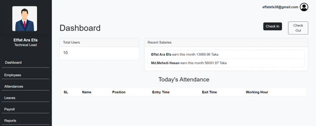
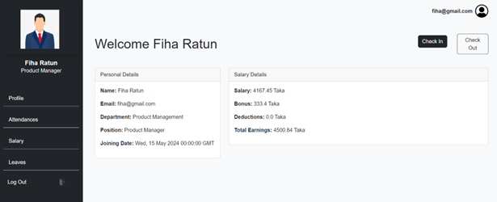
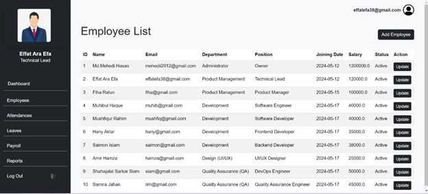
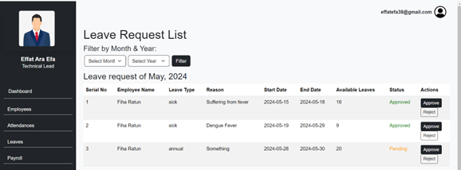
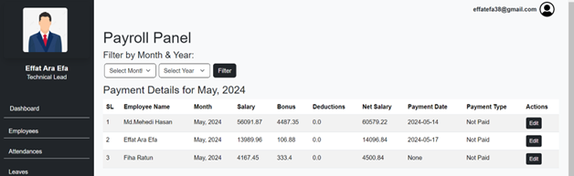

# Employee Management System (Flask)

## Description
The Employee Management System is a web application built using Flask, allowing employers to manage employee records, track attendance, and handle employee-related tasks. The system provides a simple interface for adding, updating, and deleting employee details, as well as viewing the employee list.

## Features
- **Employee Features**:
  - Add new employee records
  - Edit existing employee information
  - Delete employee records
  - View a list of employees
  - Track attendance

- **Admin Features**:
  - Admin login to access the dashboard
  - Manage employee data and attendance
  - View employee statistics and reports

## Tech Stack
- **Frontend**: HTML, CSS (Bootstrap), JavaScript
- **Backend**: Python, Flask
- **Database**: SQLite 

## Installation

### Prerequisites
- Python 3.x
- Flask
- SQLite (or another database system)

### Setup

1. Clone the repository:
    ```bash
    git clone https://github.com/Sirfowahid/Employee-Management-System.git
    cd Employee-Management-System
    ```

2. **Install Dependencies**:
    - Create a virtual environment:
        ```bash
        python -m venv venv
        ```
    - Activate the virtual environment:
        - On Windows:
            ```bash
            venv\Scripts\activate
            ```
        - On macOS/Linux:
            ```bash
            source venv/bin/activate
            ```
    - Install the required Python packages:
        ```bash
        pip install -r requirements.txt
        ```

3. **Database Setup**:
    - Run the database setup script to create the required tables:
        ```bash
        python setup_db.py
        ```

4. **Start the Flask Application**:
    - Run the Flask server:
        ```bash
        python app.py
        ```

    The app should now be running on `http://localhost:5000`.

## Usage
1. Navigate to the home page and log in as an admin.
2. Add, edit, or delete employee records from the dashboard.
3. Track employee attendance and view statistics.

## User Interface
### Dashboard

### Employee Details

### Employee List

### Leave Request

### Payroll


## Contributing
1. Fork the repository
2. Create a new branch (`git checkout -b feature-branch`)
3. Make your changes and commit them (`git commit -am 'Add new feature'`)
4. Push the branch to your fork (`git push origin feature-branch`)
5. Create a pull request

## License
This project is licensed under the MIT License - see the [LICENSE](LICENSE) file for details.
